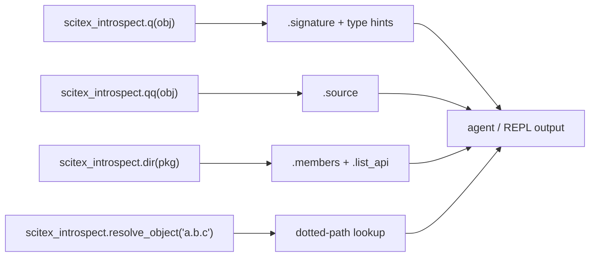

# scitex-introspect

<p align="center">
  <a href="https://scitex.ai">
    
  </a>
</p>

<p align="center"><b>IPython-style introspection for any Python package — `q`, `qq`, `dir`, signatures, source.</b></p>

<p align="center">
  <a href="https://scitex-introspect.readthedocs.io/">Full Documentation</a> · <code>uv pip install scitex-introspect[all]</code>
</p>

<!-- scitex-badges:start -->
<p align="center">
  <a href="https://pypi.org/project/scitex-introspect/"></a>
  <a href="https://pypi.org/project/scitex-introspect/"></a>
  <a href="https://github.com/ywatanabe1989/scitex-introspect/actions/workflows/test.yml"></a>
  <a href="https://codecov.io/gh/ywatanabe1989/scitex-introspect"></a>
  <a href="https://scitex-introspect.readthedocs.io/en/latest/"></a>
  <a href="https://www.gnu.org/licenses/agpl-3.0"></a>
</p>
<!-- scitex-badges:end -->

---

## Installation

```bash
pip install scitex-introspect
pip install "scitex-introspect[mcp]"   # + MCP server for AI agents
```

## Architecture

```
scitex_introspect/
├── _core.py              ← q / qq IPython-style entrypoints
├── _signature.py         ← inspect.signature with type hints
├── _docstring.py         ← docstring extraction
├── _source.py            ← getsource with fallback
├── _list_api.py          ← recursive module API tree
├── _members.py           ← attribute / method enumeration
├── _imports.py           ← static import-graph extraction
├── _call_graph.py        ← AST-based caller / callee analysis
├── _class_hierarchy.py   ← MRO + base-class walk
├── _examples.py          ← scrape doctest / examples blocks
├── _resolve.py           ← dotted-path → object resolver
├── _type_hints.py        ← typing.get_type_hints helpers
├── _mcp/                 ← MCP server tools
└── _skills/              ← agent-facing skill pages
```

Pure-stdlib core — every module is a thin layer over `inspect`,
`importlib`, `ast`, and `typing`. Zero runtime deps.

## 2 Interfaces

<details open>
<summary><strong>Python API</strong></summary>

<br>

```python
import scitex_introspect as ix

# IPython-style shortcuts
ix.q(my_func)        # Signature with type hints
ix.qq(my_func)       # Full source code
ix.dir(my_pkg)       # List attributes/methods
ix.list_api(my_pkg)  # Recursive module API tree

# Detailed inspection
ix.get_docstring(my_func)        # Parsed docstring sections
ix.get_exports(my_pkg)           # Module __all__ contents
ix.get_type_info(my_func)        # Type annotation details
ix.get_type_hints_detailed(func) # PEP-563-resolved type hints
ix.get_class_annotations(Cls)    # Class variable/method annotations
ix.get_mro(Cls)                  # Method Resolution Order

# Static analysis
ix.get_imports(file_path)        # Static import analysis via AST
ix.get_dependencies(my_mod)      # Module dependency tree
ix.get_call_graph(my_func)       # Function call graph
ix.get_function_calls(my_func)   # Simple outgoing calls list
ix.get_class_hierarchy(MyClass)  # MRO + subclass walk
ix.find_examples(my_func)        # Usage from tests/examples
ix.resolve_object("scitex.io.save")  # Dotted-path → object
```

</details>

<details>
<summary><strong>MCP Server — for AI Agents</strong></summary>

<br>

Install with `pip install "scitex-introspect[mcp]"` and the package
exposes async handlers for IPython-style introspection over MCP — agents
can ask "what's the signature of X?" or "show me the source of Y" without
running Python themselves.

</details>

## Demo



```python
>>> import scitex_introspect as ix, json
>>> ix.q(json.loads)
json.loads(s, *, cls=None, object_hook=None, ...)
>>> ix.dir(json)[:3]
['JSONDecodeError', 'JSONDecoder', 'JSONEncoder']
```

## Quick Start

```python
import scitex_introspect as ix

ix.q(my_func)        # Signature with type hints (like `my_func?`)
ix.qq(my_func)       # Full source code (like `my_func??`)
ix.dir(my_pkg)       # List attributes/methods
```

## Status

Standalone fork of `scitex.introspect`. Pure stdlib core — zero runtime
deps. The umbrella package's `scitex.introspect` import path is preserved
via a `sys.modules`-alias bridge.

## Part of SciTeX

`scitex-introspect` is part of [**SciTeX**](https://scitex.ai). Install via
the umbrella with `pip install scitex[introspect]` to use as
`scitex.introspect` (Python) or `scitex introspect ...` (CLI).

>Four Freedoms for Research
>
>0. The freedom to **run** your research anywhere — your machine, your terms.
>1. The freedom to **study** how every step works — from raw data to final manuscript.
>2. The freedom to **redistribute** your workflows, not just your papers.
>3. The freedom to **modify** any module and share improvements with the community.
>
>AGPL-3.0 — because we believe research infrastructure deserves the same freedoms as the software it runs on.

## License

AGPL-3.0-only (see [LICENSE](./LICENSE)).

---

<p align="center">
  <a href="https://scitex.ai" target="_blank"></a>
</p>
